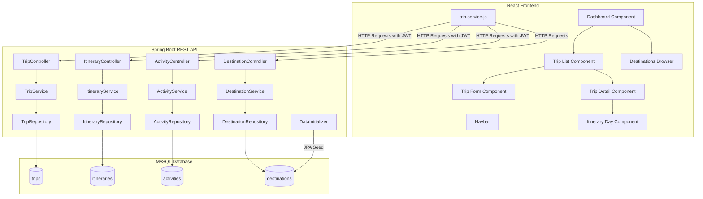

# Milestone 2: Trip & Itinerary Management Documentation

This document covers the implementation, architecture, database schemas, APIs, and design of the core travel features introduced in Milestone 2.

---

## 1. System Architecture

The architecture builds on the Milestone 1 JWT-gated security system. Below is a structural model of the newly implemented features:



---

## 2. Database Schema Model

Hibernate automatically builds and configures the following tables based on the JPA entities:

```sql
-- trips Table (Scoped to User)
CREATE TABLE trips (
  id BIGINT PRIMARY KEY AUTO_INCREMENT,
  title VARCHAR(100) NOT NULL,
  destination VARCHAR(100) NOT NULL,
  start_date DATE NOT NULL,
  end_date DATE NOT NULL,
  budget DECIMAL(15, 2),
  status VARCHAR(20) NOT NULL DEFAULT 'PLANNED', -- PLANNED, ONGOING, COMPLETED, CANCELLED
  description TEXT,
  number_of_travelers INT NOT NULL DEFAULT 1,
  user_id BIGINT NOT NULL,
  FOREIGN KEY (user_id) REFERENCES users(id) ON DELETE CASCADE
);

-- itineraries Table (A specific Day plan of a Trip)
CREATE TABLE itineraries (
  id BIGINT PRIMARY KEY AUTO_INCREMENT,
  day_number INT NOT NULL,
  date DATE,
  notes TEXT,
  trip_id BIGINT NOT NULL,
  FOREIGN KEY (trip_id) REFERENCES trips(id) ON DELETE CASCADE
);

-- activities Table (Specific events/actions within an Itinerary Day)
CREATE TABLE activities (
  id BIGINT PRIMARY KEY AUTO_INCREMENT,
  name VARCHAR(150) NOT NULL,
  description TEXT,
  activity_type VARCHAR(30) NOT NULL, -- SIGHTSEEING, TRANSPORT, ACCOMMODATION, DINING, ADVENTURE, SHOPPING
  start_time TIME,
  end_time TIME,
  location VARCHAR(200),
  cost DECIMAL(15, 2),
  itinerary_id BIGINT NOT NULL,
  FOREIGN KEY (itinerary_id) REFERENCES itineraries(id) ON DELETE CASCADE
);

-- destinations Table (Browse-only read-only directory)
CREATE TABLE destinations (
  id BIGINT PRIMARY KEY AUTO_INCREMENT,
  name VARCHAR(100) NOT NULL UNIQUE,
  country VARCHAR(100) NOT NULL,
  description TEXT,
  climate VARCHAR(100),
  best_time_to_visit VARCHAR(150),
  popular_attractions TEXT
);
```

---

## 3. API Reference

All requests to `/api/trips/**` and `/api/itineraries/**` require a valid JWT token in the `Authorization: Bearer <token>` header. Destinations endpoints (`/api/destinations/**`) are accessible without authentication.

### Trips
- `GET /api/trips` — Lists all trips created by the logged-in user.
- `GET /api/trips/{id}` — Gets details of a specific trip (verifies user ownership).
- `GET /api/trips/stats` — Retrieves summary counts (`totalTrips`, `plannedTrips`, `ongoingTrips`, `completedTrips`) for the user's dashboard.
- `POST /api/trips` — Creates a new trip.
- `PUT /api/trips/{id}` — Updates an existing trip (verifies user ownership).
- `DELETE /api/trips/{id}` — Deletes a trip and cascades delete to all associated itineraries and activities.

### Itinerary Days
- `GET /api/trips/{tripId}/itineraries` — Gets list of days scheduled for a trip.
- `POST /api/trips/{tripId}/itineraries` — Adds a new day (e.g. Day 1, Day 2) to the trip.
- `PUT /api/trips/{tripId}/itineraries/{id}` — Edits day parameters (notes, dates).
- `DELETE /api/trips/{tripId}/itineraries/{id}` — Deletes a day and cascades delete to its activities.

### Activities
- `GET /api/itineraries/{itineraryId}/activities` — Gets all activities planned for that specific day.
- `POST /api/itineraries/{itineraryId}/activities` — Creates an activity (Sightseeing, Dinning, Transport, etc.) on that day.
- `PUT /api/itineraries/{itineraryId}/activities/{id}` — Edits activity details.
- `DELETE /api/itineraries/{itineraryId}/activities/{id}` — Deletes the activity.

### Destinations
- `GET /api/destinations` — Fetches the default list of global seeded travel destinations.
- `GET /api/destinations/search?q={query}` — Searches destinations by country or city name.
- `GET /api/destinations/{id}` — Returns a full breakdown of climate, best season to visit, and main attractions.

---

## 4. Frontend Component Breakdown

The React client implements the following user interfaces using the consistent clean stylesheet layout defined in `App.css`:

### A. Dashboard View (`/dashboard`)
Displays cards summarizing total trips and status breakdowns. It features a list of the user's upcoming trips and quick actions (Plan a Trip, View Trips, Explore Destinations).

### B. Trips Overview Page (`/trips`)
Presents a grid of custom card components showing trip details. Includes a text search and tabbed filtering system based on statuses (PLANNED, ONGOING, COMPLETED, CANCELLED).

### C. Planner & Itinerary Builder (`/trips/:id`)
Acts as the central planning interface. It pulls details of the trip, shows dates, duration, budget, and displays day cards (`ItineraryDay.js`).
- Allows adding days via a simple collapsible form.
- Contains an inline activity creation and edit panel for adding items directly under any specific day card.
- Features distinct icons corresponding to activity types (e.g., 🏛️ for Sightseeing, 🍽️ for Dining, 🚗 for Transport).

### D. Destination Browser (`/destinations`)
Allows users to explore pre-seeded cities. Includes a live debounced search system. Clicking "View Details" opens a modal overlay displaying rich travel details (climate conditions, top travel seasons, and a tagged list of popular attractions).

---

## 5. Setup & Seeding Details

### Automatic Seeding
- **Roles:** Handled idempotently by `TripnestApplication`'s `CommandLineRunner` on startup (`ROLE_TRAVELER`, `ROLE_AGENT`, `ROLE_ADMIN`).
- **Destinations:** Handled by `DataInitializer` upon startup using Spring Data JPA. Checks if records exist and seeds 10 popular destinations (Paris, Tokyo, Bali, Santorini, etc.) if empty.
